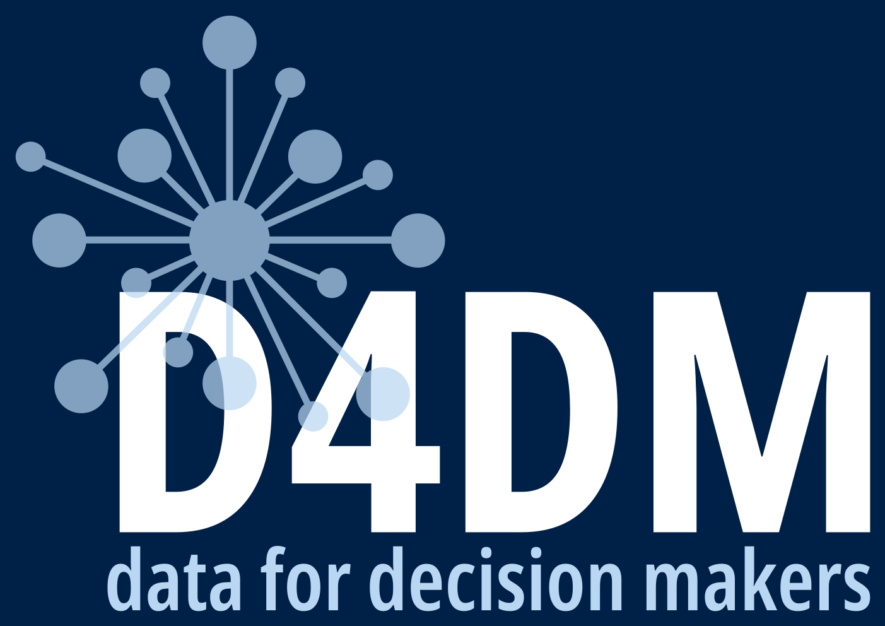

# Data for Decision Makers 

<!-- badges: start -->


[](https://github.com/data4decisionmakers/data4decisionmakers.github.io/actions/workflows/publish.yml)
<!-- badges: end -->

## About this repository

This repository builds and serves the Data for Decisionmakers [website](https://d4dm.org) which is designed and coded using [R](https://r-project.org) language and environment for statistical computing and [Quarto](https://quarto.org), an open source scientific and technical publishing system.

## Reproducibility

This repository uses R version 4.5.0. R packages used in this repository are versioned using [`{renv}`](https://rstudio.github.io/renv/index.html). To reproduce the website's R package environment, please run:

```R
renv::restore()
```

on the R console.

To preview the website locally, run the following command on Terminal:

```bash
quarto preview
```

The website is rendered via GitHub Actions and published via GitHub Pages automatically every time changes are pushed to the main branch.


## Authors and developers

* Proochista Ariana
* Ernest Guevarra


## Licenses

All code used to produce this website is released under a [GPL-3.0](https://opensource.org/license/gpl-3-0) license. All text/written work in this website is released under a [CC-BY-4.0](https://creativecommons.org/licenses/by/4.0/) license.