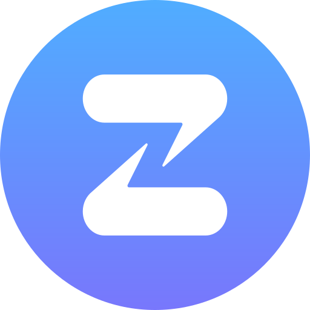

::: {.community-banner}

::: {.info-block}

# Our community is at the heart of everything we do, bringing people together to share knowledge, learn from one another, and shape the direction of our work. Through co-learning and co-creation, community members develop practical skills, exchange experience, and build solutions that respond to real-world decision-making needs.

:::

:::

::: {.approach-banner}

::: {.info-block}

::: {.img-float}

{style="float: left; margin: 10px; width: 300px"}

:::

# Community calls

Our planned quarterly community call is when our community gets to come together and connect. We envision a forum by which the community is able to discuss on the relevant topics identified by community members.

We plan to hold our first community call sometime in September 2026.

:::

:::

<!-- ::: {.event-banner}

::: {.info-block}

# Featured Events

Upcoming events that involve Oxford iHealth and its community members.

You can subscribe to Oxford iHealth-led events by downloading our [our ICS calendar](https://calendar.google.com/calendar/ical/c_0db826712181c28f2b7e5c0f11b8c08b11f4e844894ab03b77702ccaf7d9c5df%40group.calendar.google.com/public/basic.ics) and adding it to your calendar service/application.

See a full listing and calendar of upcoming events [here](https://oxford-ihtm.io/events/).

::: {#featured-events}
:::

:::

::: -->

::: {.event-banner}

::: {.info-block}

::: {.img-float}

[{style="float: right; margin: 10px; width: 300px"}](https://zulip.com/)

:::

# Community chat and forum

We offer our global alumni network a community forum for discussing, connecting, and collaborating. We are fortunate to have been gifted with sponsored hosting by [Zulip](https://zulip.com){.external target="_blank"}, an organised team chat app designed for efficient communication. Invitations to join the community chat group on Zulip are usually handed out during or after a community event. If you would like to join the Data for Decision Makers community chat group on Zulip but have not had the chance to be invited, please send us a message via our [about page](../about/contact.qmd) requesting an invite.

:::

:::
