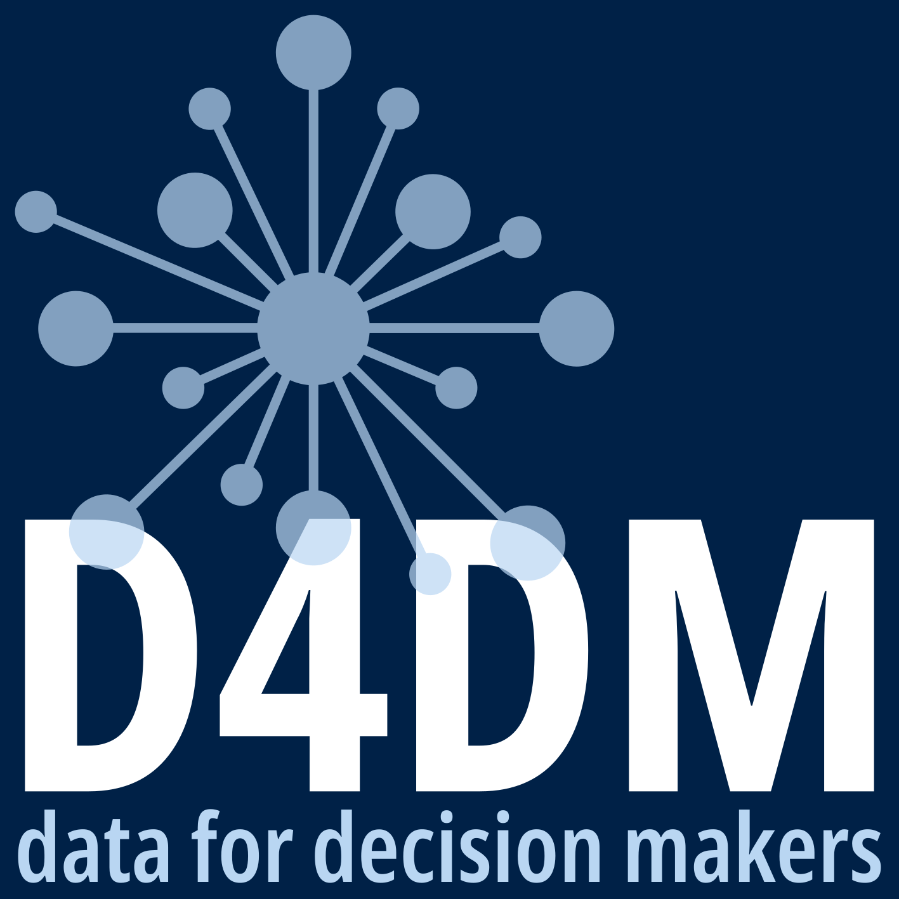
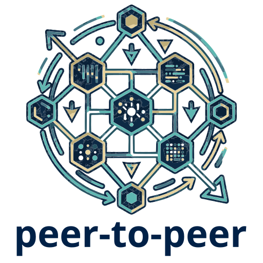
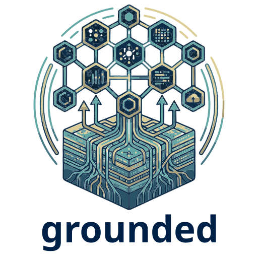
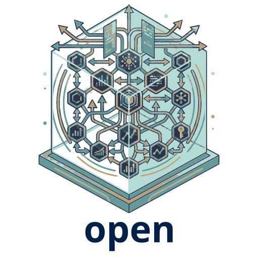

```{r}
#| label: setup
#| include: false

library(quarto)
```

::: {.hero-banner}

::: {.content-block}

::: {.hero-text}

# Building a community of practice on data and its use for transformative change

### We are a community of practitioners from diverse sectors, engaging in data of different shapes and sizes with varying skills, capacities, and tools. We support each other through grounded and practical short courses, open and accessible technical guidance, and impactful peer-to-peer learning. 

::: {.hero-buttons}
[Our mission](/about/index.qmd){#btn-guide .btn-action .btn .btn-info .btn-lg role="button"}
::: 

:::

::: {.hero-image-right}

{fig-align="right" height="350px"}

:::

:::

:::


::: {.theme-banner}

::: {.info-block}

# Our approach is

::: {.grid}

::: {.g-col-4}

{fig-align="center"}

#### Better data skills, built through collaboration.


:::

::: {.g-col-4}

{fig-align="center"}

#### Making data meaningful by grounding learning in practice.

:::

::: {.g-col-4}

{fig-align="center"}

#### Open by design. Stronger through shared learning.


:::

:::

:::

:::


